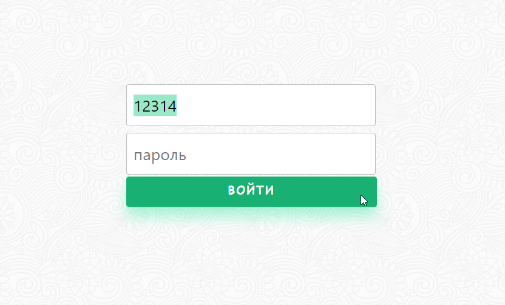

# Messenger

Сделан с помощью [React](https://github.com/facebook/create-react-app).

<!-- ## Available Scripts
In the project directory, you can run: -->

### `npm start`
Запуск frontend.

### `npm run server`
Запуск backend.

### `Авторизация`
